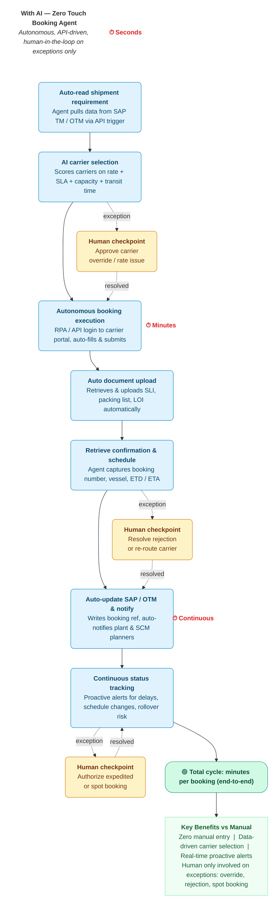

# Zero Touch Booking Agent — Workflow



---

## Legend

| Color | Meaning |
|-------|---------|
| 🟦 Light blue | AI Agent (autonomous) |
| 🟨 Yellow | Human checkpoint (exception only) |
| 🟩 Green | Summary / benefits |
| Dashed lines | Exception path (only when triggered) |

---

## System Integrations

```
SAP TM / OTM ←→ Agent ←→ Carrier Portals (Maersk, MSC, Hapag-Lloyd, CMA-CGM)
                  ↓
        Email / EDI / API triggers
                  ↓
    Notifications → Plant, SCM Planners
```
