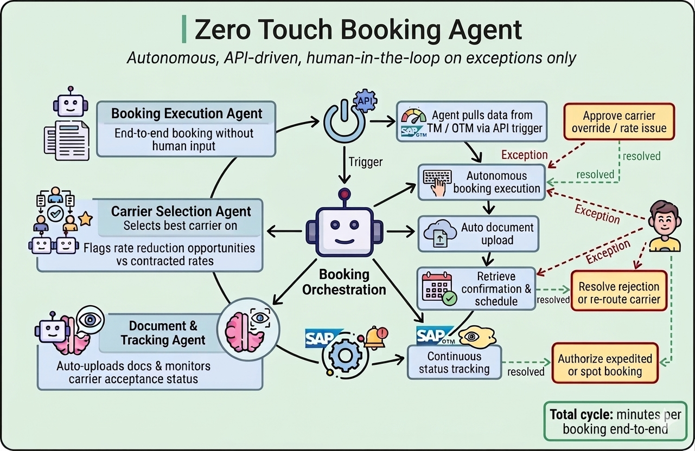

# Zero Touch Booking Agent — Workflow

```mermaid
flowchart LR
    %% ─── Central Orchestrator ───
    Bot(("🤖\nBooking\nOrchestration"))

    %% ─── AI Agents (left) ───
    A1["<b>Booking Execution Agent</b>\nEnd-to-end booking\nwithout human input"]
    A2["<b>Carrier Selection Agent</b>\nBest carrier on rate + SLA\n+ rate reduction flagging"]
    A3["<b>Document & Tracking Agent</b>\nAuto-uploads docs & monitors\ncarrier acceptance"]

    A1 --> Bot
    A2 --> Bot
    A3 --> Bot

    %% ─── Workflow Steps (right of bot) ───
    Bot -->|"API\ntrigger"| S1
    S1["<b>1. Ingest & Select</b>\nRead SAP TM/OTM → Score carriers\n→ Recommend optimal"]
    S1 --> S2
    S2["<b>2. Book & Upload</b>\nRPA/API portal login → Submit\n→ Attach SLI, packing list"]
    S2 --> S3
    S3["<b>3. Confirm & Sync</b>\nCapture BKG# + ETD/ETA\n→ Write-back SAP/OTM → Notify plant"]
    S3 --> S4
    S4["<b>4. Monitor</b>\nContinuous tracking → Proactive\nalerts for delays & rollover"]

    %% ─── Human Checkpoints (right) ───
    S1 -. "exception" .-> H1
    H1["<b>H1: Carrier Override</b>\nApprove carrier change\nor resolve rate issue"]
    H1 -. "resolved" .-> S2

    S3 -. "exception" .-> H2
    H2["<b>H2: Rejection / Re-route</b>\nResolve carrier rejection\nor re-route booking"]
    H2 -. "resolved" .-> S3

    S4 -. "exception" .-> H3
    H3["<b>H3: Spot Booking</b>\nAuthorize expedited\nor off-contract rate"]
    H3 -. "resolved" .-> S4

    %% ─── Timing ───
    T1(["⏱ Seconds"])
    T2(["⏱ Minutes"])
    T3(["⏱ Continuous"])
    T1 ~~~ S1
    T2 ~~~ S3
    T3 ~~~ S4

    %% ─── Footer ───
    S4 --> Summary["🟢 <b>Total: minutes per booking end-to-end</b>"]

    %% ─── Styling ───
    classDef bot fill:#e0f7fa,stroke:#00897b,color:#004d40,stroke-width:3px
    classDef agent fill:#e8f5e9,stroke:#2e7d32,color:#1b5e20
    classDef step fill:#e3f2fd,stroke:#1565c0,color:#0d47a1
    classDef human fill:#fff8e1,stroke:#e65100,color:#bf360c
    classDef time fill:none,stroke:none,color:#c62828,font-weight:bold
    classDef summary fill:#e8f5e9,stroke:#2e7d32,color:#1b5e20

    class Bot bot
    class A1,A2,A3 agent
    class S1,S2,S3,S4 step
    class H1,H2,H3 human
    class T1,T2,T3 time
    class Summary summary
```

## 精简说明

| 原7步 | 合并为4步 |
|-------|----------|
| 1. Read shipment + 2. Carrier selection | **1. Ingest & Select** |
| 3. Booking execution + 4. Document upload | **2. Book & Upload** |
| 5. Confirmation + 6. SAP update & notify | **3. Confirm & Sync** |
| 7. Status tracking | **4. Monitor** |

| AI Agent | 驱动 |
|----------|------|
| Booking Execution Agent | Step 1 → 2 全链路 |
| Carrier Selection Agent | Step 1 评分 + 费率谈判 |
| Document & Tracking Agent | Step 2 上传 + Step 4 监控 |
