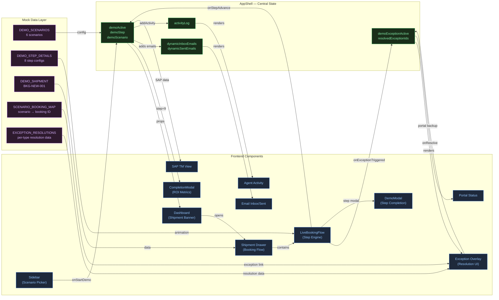

# Zero Touch Booking Agent — Architecture Flow

```mermaid
flowchart TD
    %% ─── Entry ───
    Start([User Selects Scenario]) --> ScenarioSwitch{Scenario Type}

    ScenarioSwitch -->|Happy Path| HP[No Exception]
    ScenarioSwitch -->|Missing Data| MD[Exception @ Step 1]
    ScenarioSwitch -->|No Carrier Capacity| NC[Exception @ Step 2]
    ScenarioSwitch -->|Portal Failure| PF[Exception @ Step 3]
    ScenarioSwitch -->|Rate Mismatch| RM[Exception @ Step 4]
    ScenarioSwitch -->|Carrier Rejection| CR[Exception @ Step 6]

    HP & MD & NC & PF & RM & CR --> Init

    %% ─── Initialization ───
    Init[Initialize Demo State\ndemoActive=true, demoStep=0] --> Banner
    Banner[Dashboard: New Shipment Detected\nSHA → LAX · 2×40 HC · Ocean] --> ViewBook
    ViewBook[User Clicks View & Book] --> Drawer
    Drawer[Shipment Drawer Opens\nBooking Mode Activated] --> Step1

    %% ─── 8-Step Autonomous Workflow ───
    subgraph Workflow ["⚡ 8-Step Autonomous Booking Workflow"]
        direction TB
        Step1["Step 1: Read Shipment\n🤖 Parse SAP TM order\n📊 12 fields extracted · 99% confidence"]
        Step2["Step 2: Carrier Selection\n🤖 Evaluate 4 carriers on rate + SLA\n📊 Maersk recommended @ $2,850 · 94%"]
        Step3["Step 3: Portal Login\n🤖 RPA/API secure login to Maersk\n📊 Session established · 98%"]
        Step4["Step 4: Booking Submission\n🤖 Submit vessel + container allocation\n📊 Request transmitted · 96%"]
        Step5["Step 5: Document Upload\n🤖 Attach SI + commercial invoice\n📊 2 documents verified · 99%"]
        Step6["Step 6: Confirmation\n🤖 Retrieve booking # + schedule\n📊 BKG confirmed · 100%"]
        Step7["Step 7: System Update\n🤖 Write-back to SAP TM + OTM\n📊 3 systems synced · 99%"]
        Step8["Step 8: Monitoring\n🤖 Track carrier acceptance status\n📊 Proactive alerts armed · 100%"]

        Step1 --> Step2 --> Step3 --> Step4 --> Step5 --> Step6 --> Step7 --> Step8
    end

    %% ─── Per-Step Animation Engine ───
    subgraph StepEngine ["Step Animation Engine (per step)"]
        direction TB
        Thinking["Phase: Thinking\n⏳ AI processing animation\n(duration × 0.6)"]
        Revealing["Phase: Revealing\nSub-items appear one-by-one\n(340ms interval)"]
        Complete["Phase: Complete\nModal shows AI reasoning\n+ confidence + sources"]
        UserContinue["User Clicks Continue\n→ Side effects fire\n→ Advance to next step"]

        Thinking --> ExCheck{Exception\nat this step?}
        ExCheck -->|No| Revealing --> Complete --> UserContinue
        ExCheck -->|Yes| TriggerEx[Trigger Exception\ndemoExceptionActive=true]
    end

    %% ─── Exception Resolution Flows ───
    subgraph Exceptions ["⚠️ Exception Resolution"]
        direction TB

        TriggerEx --> ExType{Exception Type}

        ExType -->|Missing Data\nStep 1| MDF["Missing Booking Fields\n1. AI auto-fills 2/3 fields\n2. Email plant for shipper contact\n3. User navigates to Inbox\n4. Reply received → 3rd field filled\n→ Resolved"]

        ExType -->|No Capacity\nStep 2| NCF["Missing Allocation\n1. Show capacity alert\n2. AI finds 3 alternatives\n   (Maersk LGB / MSC / DHL)\n3. User selects carrier\n→ Resolved"]

        ExType -->|Portal Failure\nStep 3| PFF["Portal Unavailable (503)\n1. Show HTTP 503 error\n2. User confirms backup switch\n3. Navigate to Portal Status view\n4. Backup connection established\n→ Resolved"]

        ExType -->|Rate Mismatch\nStep 4| RMF["Rate Discrepancy\n$3,340 vs contract $2,800\n1. AI drafts counter-offer ($3,024)\n2. Email to carrier rates team\n3. User navigates to Inbox\n4. Carrier accepts negotiated rate\n→ Resolved"]

        ExType -->|Carrier Rejection\nStep 6| CRF["Booking Rejected\n1. Show rejection alert\n2. AI finds alternatives\n3. User selects new carrier\n→ Resolved"]

        MDF & NCF & PFF & RMF & CRF --> Resolved
    end

    Resolved["Exception Resolved\nexceptionResolved=true"] --> FastForward

    %% ─── Fast Forward ───
    FastForward["⚡ Fast-Forward Remaining Steps\nNo modals · Rapid animation\nAuto-advance to completion"]

    %% ─── Completion ───
    Step8 --> Completion
    FastForward --> Completion

    Completion["🎉 Completion Modal\ndemoStep = 9"]

    subgraph CompletionMetrics ["Completion Dashboard"]
        direction LR
        M1["Manual: 45 min"]
        M2["Workflow Tool: 15 min"]
        M3["Zero Touch: ~2 min"]
        KPI1["84% Zero-Touch Rate"]
        KPI2["87% On-Time Booking"]
        KPI3["$2.4M Annual Savings"]
    end

    Completion --> CompletionMetrics --> EndDemo
    EndDemo["User Clicks End Demo\n→ All state reset\n→ Return to Dashboard"]

    %% ─── Side-Effect Channels ───
    subgraph SideEffects ["📡 Side Effects During Workflow"]
        direction LR

        subgraph EmailSent ["Emails Sent"]
            E1["Step 4 → Booking request\nto Maersk"]
            E2["Step 7 → Confirmation\nto Plant + SCM"]
        end

        subgraph EmailReceived ["Emails Received"]
            E3["Step 6 → Carrier\nconfirmation email"]
            E4["Exception → Reply\nfrom plant / carrier"]
        end

        subgraph SystemUpdates ["System Updates"]
            S1["Step 1 → Read SAP TM"]
            S2["Step 7 → Write SAP TM\n+ OTM sync"]
        end

        subgraph ActivityLog ["Agent Activity Log"]
            A1["Each step →\nTimestamped entry\nwith action type"]
        end
    end

    %% ─── Styling ───
    classDef scenario fill:#1e3a5f,stroke:#3b82f6,color:#93c5fd
    classDef step fill:#1a1a2e,stroke:#6366f1,color:#a5b4fc
    classDef exception fill:#3b1f1f,stroke:#ef4444,color:#fca5a5
    classDef resolved fill:#1a2e1a,stroke:#22c55e,color:#86efac
    classDef completion fill:#2e1a2e,stroke:#a855f7,color:#d8b4fe
    classDef sideeffect fill:#1a2626,stroke:#14b8a6,color:#99f6e4

    class HP,MD,NC,PF,RM,CR scenario
    class Step1,Step2,Step3,Step4,Step5,Step6,Step7,Step8 step
    class MDF,NCF,PFF,RMF,CRF,TriggerEx exception
    class Resolved,FastForward resolved
    class Completion,EndDemo completion
    class E1,E2,E3,E4,S1,S2,A1 sideeffect
```

## Component Interaction Diagram

```mermaid
graph LR
    subgraph UI ["Frontend Components"]
        Sidebar["Sidebar\n(Scenario Picker)"]
        Dashboard["Dashboard\n(Shipment Banner)"]
        Drawer["Shipment Drawer\n(Booking Flow)"]
        LiveFlow["LiveBookingFlow\n(Step Engine)"]
        ExOverlay["Exception Overlay\n(Resolution UI)"]
        DemoModal["DemoModal\n(Step Completion)"]
        CompModal["CompletionModal\n(ROI Metrics)"]
        EmailPage["Email Inbox/Sent"]
        AgentLog["Agent Activity"]
        SAPTM["SAP TM View"]
        PortalStatus["Portal Status"]
    end

    subgraph State ["AppShell — Central State"]
        DS["demoActive\ndemoStep\ndemoScenario"]
        ES["demoExceptionActive\nresolvedExceptionIds"]
        Emails["dynamicInboxEmails\ndynamicSentEmails"]
        Activities["activityLog"]
    end

    subgraph Data ["Mock Data Layer"]
        Scenarios["DEMO_SCENARIOS\n6 scenarios"]
        Steps["DEMO_STEP_DETAILS\n8 step configs"]
        Shipment["DEMO_SHIPMENT\nBKG-NEW-001"]
        BookingMap["SCENARIO_BOOKING_MAP\nscenario → booking ID"]
        Resolutions["EXCEPTION_RESOLUTIONS\nper-type resolution data"]
    end

    Sidebar -->|onStartDemo| DS
    DS -->|props| Dashboard
    Dashboard -->|opens| Drawer
    Drawer -->|contains| LiveFlow
    LiveFlow -->|onStepAdvance| DS
    LiveFlow -->|onExceptionTriggered| ES
    ES -->|renders| ExOverlay
    ExOverlay -->|onResolve| ES
    LiveFlow -->|step modal| DemoModal
    DS -->|step=9| CompModal
    DS -->|adds emails| Emails
    Emails -->|renders| EmailPage
    DS -->|addActivity| Activities
    Activities -->|renders| AgentLog
    DS -->|SAP data| SAPTM
    ES -->|portal backup| PortalStatus

    Scenarios -->|config| DS
    Steps -->|animation| LiveFlow
    Shipment -->|data| Drawer
    BookingMap -->|exception link| ExOverlay
    Resolutions -->|resolution data| ExOverlay

    classDef ui fill:#1e293b,stroke:#3b82f6,color:#93c5fd
    classDef state fill:#1a2e1a,stroke:#22c55e,color:#86efac
    classDef data fill:#2e1a2e,stroke:#a855f7,color:#d8b4fe

    class Sidebar,Dashboard,Drawer,LiveFlow,ExOverlay,DemoModal,CompModal,EmailPage,AgentLog,SAPTM,PortalStatus ui
    class DS,ES,Emails,Activities state
    class Scenarios,Steps,Shipment,BookingMap,Resolutions data
```
